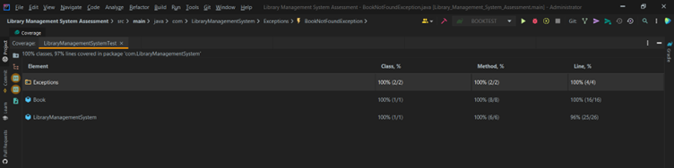
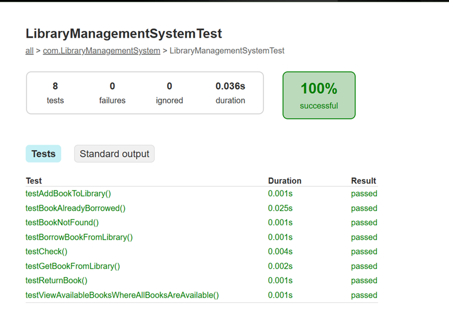
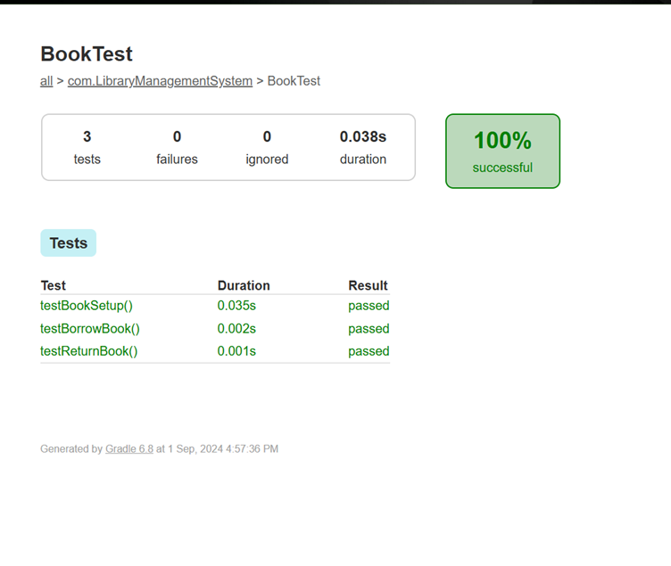

# Library Management System

This project implements a Library Management System using object-oriented principles in Java. It includes classes such as Book and LibraryManagementSystem, along with corresponding unit and integration tests to verify the functionality of borrowing and managing books in a library system.


## Features

- Book Management: Add, remove, and manage the availability of books.
- Borrowing Books: Users can borrow books from the library, which updates the status of the books.
- Test Cases: Unit tests for individual components like Book, and integration tests for Library.


## Structure

The project is divided into two key components:

- Book Class (Book.java)

    Handles the internal properties and actions of a book (e.g., title, author, availability, borrow status).
    Tested in BookTest.java.
- LibraryManagementSystem Class (LibraryManagementSystem.java)

    Manages a collection of books and handles borrowing, returning, and finding books.
    Tested in LibraryManagementSystemTest.java.
## Tests
**'BookTest'**

This test file focuses on the Book class and checks:

- Borrowing a book changes its status correctly.
- Returning a borrowed book marks it as available.
- 
**'LibraryManagementSystemTest'**

 This test file focuses on the Library class and checks:

- Borrowing a book from the library updates the system correctly.
- Integration of the Book and Library classes to ensure proper management of books.

## Getting Started
**Prerequisites**
- IDE: IntelliJ IDEA (recommended) or any Java-compatible IDE.
- Java JDK: You need Java installed on your system to run the application and the tests.
- JUnit 5: JUnit 5 is used for unit and integration testing. You can add JUnit to your project using Maven or Gradle.
## Setting Up the Project
**1. Install IntelliJ IDEA**

- Download IntelliJ IDEA from the [official website](https://www.jetbrains.com/idea/download/).

- Install IntelliJ IDEA by following the installation instructions for your operating system.

**2. Clone the Repository**

Open a terminal and run the following command to clone the repository:

```bash 
git clone https://github.com/Mahek-Gohil/library-Management-System-Asessment-Incubyte-.git
```

**3. Open the Project in IntelliJ IDEA**

- Launch IntelliJ IDEA.

- Click on "Open" and navigate to the cloned project directory.

- Select the directory and click "OK" to open the project.

**4. Configure the Project**

1.Add JDK:
- Go to File -> Project Structure.

- Under Project, set the Project SDK to Java 11 or later.
  
2.Add JUnit 5:

- Go to File -> Project Structure -> Modules.

- Select your module and go to the Dependencies tab.

- Click the + icon to add a new dependency.

- Choose "Library" -> "From Gradle" and search for junit:junit:5.7.0.

- Add JUnit 5 to your project dependencies.
  
**5. Build the Project**

- IntelliJ IDEA will automatically detect and compile the project files. If not, you can manually build the project by going to Build -> Build Project.


## Running the Tests
**Using IntelliJ IDEA:**

- Open the test files (BookTest.java and LibraryManagementSystemTest.java).
- Right-click on the test class or method and select Run 'BookTest' or Run 'LibraryManagementSystemTest'.
## Test Coverage And Report

**Test Coverage**



**Test Report**





